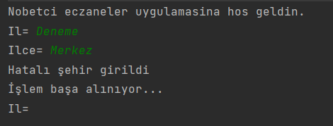
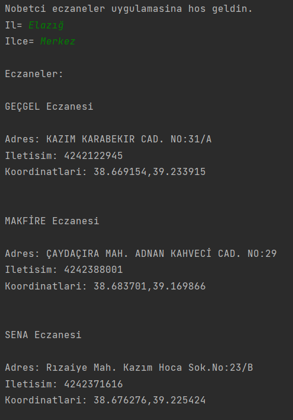

# Bilg.Sist.Lab Dersi | Deney: API Kullanımı |

Bu ödevde katkıda bulunanlar:
    
    - Rumeysa Hançer | 16260003
    - Ravza Nur Ümütlü | 170260073
    - Furkan Ali Ünal | 15260038

Uygulama nasıl çalıştırılır?
    
    - https://collectapi.com/tr/ hesabı açılır
    - https://api.collectapi.com/health/dutyPharmacy URI li API a kayıt olunur
    - Profilden api key alınır
    - Main metodu içerisindeki key alanına yerleştirili
    ```java
        private static String key = "Buraya API Tokeninizi Yerlestirin";
    ``` 
    - Class çalıştırılır




    Eklenecekler:
    - API menüsü (uygulama birden fazla API kullanarak birden fazla iş yapacak)
    - API sunucusu (her istekte bir sorgu hakkı kullanılması yerine bir sunucu bağlantısı kurulacak ve bu sunucu her dört saatte bir sorgu yapıp verilerini güncelleyecek)